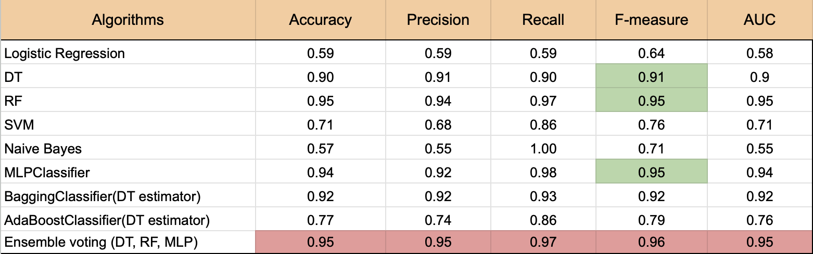
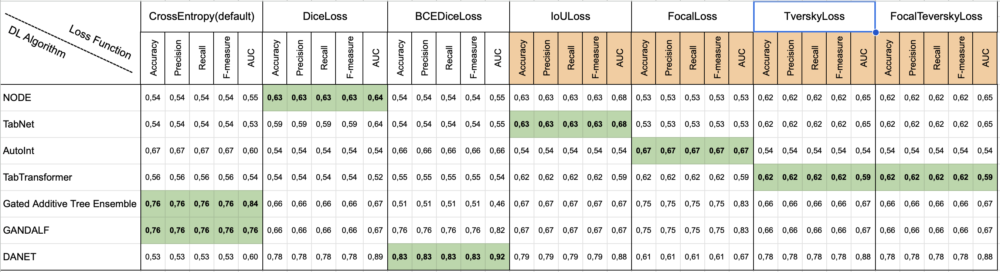

# Advanced Data Analytics (INS401602)

## Overview 🔍

This repository contains the official codebase for the Advanced Data Analytics course (INS401602). The project focuses on analyzing financial data from 364 Vietnamese companies to classify whether their end-of-year financial statements have been modified based on various financial metrics.

### Dataset
The financial information was manually collected from annual end-of-year financial reports. The following metrics are analyzed:

| **Variable**          | **Description** |
|-----------------------|---------------------------------------------------------------------------------|
| **EBIT**              | Earnings Before Interest and Taxes |
| **IE**                | Interest Expense |
| **EBIT - IE**         | EBIT minus Interest Expense |
| **WC/TA**             | Working Capital to Total Assets ratio |
| **TL/TA**             | Total Liabilities to Total Assets ratio |
| **EBIT/IE**           | Interest Coverage Ratio |
| **NOCF/CL**           | Net Operating Cash Flow to Current Liabilities ratio (Operating Cash Flow Ratio)|
| **RE/TA**             | Retained Earnings to Total Assets ratio |
| **NP/S**              | Net Profit Margin |
| **EBIT/TA**           | Return on Assets (before interest and taxes) |
| **S/TA**              | Asset Turnover Ratio |
| **TA(t)/TA(t-1)**     | Total Asset Growth Rate |
| **NP(t)/NP(t-1)**     | Net Profit Growth Rate |
| **MVE/TL**            | Market Value of Equity to Total Liabilities ratio |


## Research Methodology 📊

Our research compares the performance of traditional machine learning algorithms with specialized deep learning models for tabular data. The methods are categorized into three groups:

### Model Categories

| **Traditional**           | **Ensemble**      | **Deep Learning**  |
|---------------------------|-------------------|--------------------|
| Logistic Regression       | Bagging           | NODE               |
| Decision Tree             | Boosting          | TabNet             |
| Random Forest             | Ensemble Voting   | AutoInt            |
| Support Vector Machine    |                   | TabTransformer     |
| Naive Bayes               |                   | GATE               |
| Artificial Neural Network |                   | GANDAF             |
|                           |                   | DANETs             |

### Loss Functions
For each deep learning model, we experiment with six types of loss functions:
- DiceLoss
- BCEDiceLoss
- IoULoss
- FocalLoss
- TverskyLoss
- FocalTverskyLoss

Performance evaluation metrics include:
- Accuracy
- Precision
- Recall
- F1 Score
- AUC

## Results 📈

### Machine Learning Models Performance


### Deep Learning Models Performance


## Getting Started 🚀

### Option 1: Build from Source

1. Clone the repository:
```bash
git clone https://github.com/PhungQuan-business/Advanced-Data-Analytics.git
```

2. Create and activate the Conda environment:
```bash
conda env create -f environment.yml
conda activate financial-restatement
```

3. Navigate to the source code and start the Streamlit app:
```bash
cd /src
streamlit run app.py
```

### Option 2: Using Docker

1. Pull the Docker image:
```bash
docker pull quanbusiness/financial-restatement-classifier:latest
```

2. Create and run the container:
```bash
docker run -d -p 8501:8501 --name streamlit-container quanbusiness/financial-restatement-classifier:latest
```

3. Access the web application at [localhost:8501](localhost:8501)

## Contributors 👥

### Instructor
Thanks to PhD. Trương Công Đoàn for the valuable guidance.

### Members
- Vũ Thu Huyền (21070237)
- Huỳnh Minh Quân (21070801)
- Hoàng Ngọc Khoa (21070330)
- Phùng Hồng Quân (21070534)